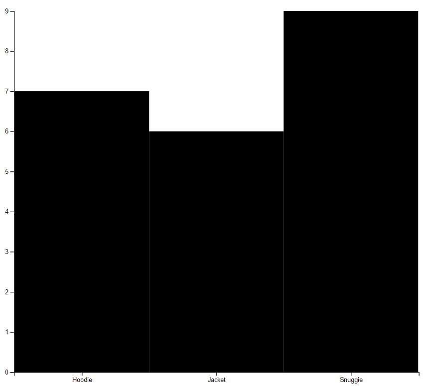
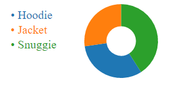

# 02 Charts / 02 BarChart

1) Add a padding between each of the chart bars.


2) What about adding some color to each bar, based on the product Id ?

Some tips:

- We can treat product category as an ordinal.

- We can create a function that returns a color based on 
an existing d3 SchemeCategory

```javascript
// helper that returns a color based on an ID
var barColor = d3.scaleOrdinal(d3.schemeCategory10);
```

The React it self has an attribute called filled, we can
attach to it a _function(d)_ extract from it the current product
and invoke the color function we have previously created.

3) Let's rotate 90º the bar chart, we want it to show it like:



If you need some help, a similar sample can be found: 

[Blocks Sample](http://bl.ocks.org/d3noob/8952219) 

# 02 Charts / 05 Lines

4) Add one more line to the chart, this line will represent
a set of expenses.


# 02 Charts / 06 Pie

4) Create a Doughnut like chart.



5) Make the pie chart scale and take all the available canvas space, plus include margin for legend.

```diff
function setupCanvasSize() {
  margin = {top: 0, left: 80, bottom: 20, right: 30};
+  width = 760 - margin.left - margin.right;
+  height = 660 - margin.top - margin.bottom;
}

function appendPieChart()
{
  // Where to get the measure data
  var pie = d3.pie()
    .value(function(d) { return d.sales })

  // Calculate Arcs
  var slices = pie(totalSales);

  // Pie chart size
  var arc = d3.arc()
    .innerRadius(0)
+    .outerRadius(height / 2);

+  var positionX = width / 2;
+  var positionY = height / 2;

  // Draw the pie
  svg.selectAll('path.slice')
    .data(slices)
      .enter()        
        .append('path')
          .attr('class', 'slice')
          .attr('d', arc)
          .attr('fill', function(d) {
            return color(d.data.product);
          })
+          .attr("transform", `translate(${positionX}, ${positionY})`)
          ;
}

```

